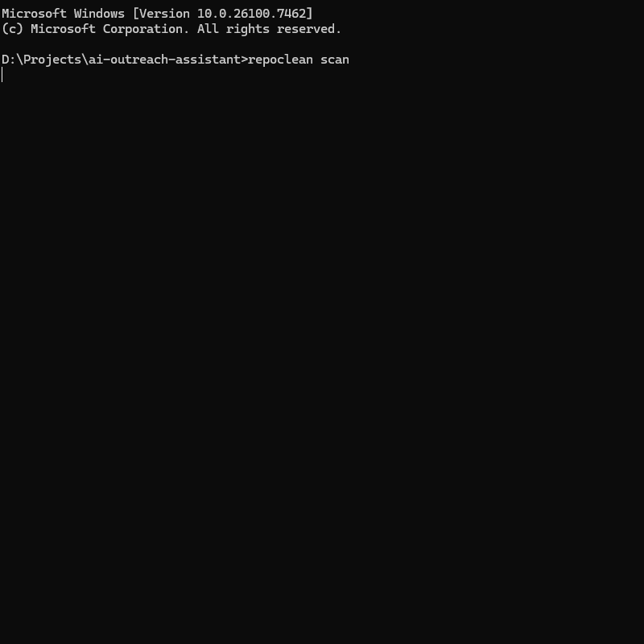

# Repoclean (CLI) v0.8.0


repoclean — GitHub Repo Cleanup & Secret Leak Prevention CLI

A fast repo hygiene scanner + scary-good secrets detector + pre-commit hook that blocks risky commits automatically.

## Why repoclean exists


Most repo leaks don’t happen because people are careless — they happen because shipping is fast and repo hygiene is manual.

repoclean stops:

- accidental API key/token leaks
- pushing `.env`, `.pem`, `id_rsa` etc
- committing junk (`__pycache__/`, `.log`, `.tmp`, `dist/`, etc)
- committing huge files that bloat history

`repoclean` is a small CLI tool meant to be run before pushing to GitHub. It helps you quickly:

- spot repo hygiene issues
- detect secret/token patterns
- block accidental leaks via an optional Git pre-commit hook

## Demo



## Install

```bash
pip install repoclean-cli
```

## Quick Start

```bash
repoclean scan
repoclean secrets
```


```md
## Secrets scanner (v0.6.0)

repoclean detects:
- Private key markers (`BEGIN PRIVATE KEY`)
- GitHub tokens (`ghp_`, `github_pat_`, `gho_`)
- Slack tokens (`xoxb-...`)
- Stripe live keys (`sk_live_...`)
- Telegram bot tokens (`123456:ABC...`)
- JWT tokens
- High entropy secret candidates in assignment contexts
```


## CI usage

```bash
repoclean ci
repoclean scan --fail-on sensitive,large
repoclean secrets --fail
```

## Typical workflow

```bash
repoclean scan
repoclean secrets --fail
repoclean fix --yes
repoclean install-hook --mode strict
```

# Secrets severity + CI

```bash
repoclean secrets --min-severity high
repoclean secrets --fail-on critical
repoclean ci --json
```

# Command

##### Scan repo hygiene issues

```bash
repoclean scan
```

##### Create a default .gitignore

```bash
repoclean init
```

##### Config

Create a .repoclean.toml config file:

```bash
repoclean config init
```

##### Safely clean junk files/folders

Preview:

```bash
repoclean fix --dry-run --verbose
```

Apply cleanup:

```bash
repoclean fix --yes
```


```md
### Unstage instead of delete

```bash
repoclean fix --staged-only --unstage --yes
```


##### Scan for secrets/tokens

```bash
repoclean secrets
```

Fail mode (useful for CI and hooks):

```bash
repoclean secrets --fail
```

## Install git pre-commit hook

##### Install (strict mode blocks commit on issues):

```bash
repoclean install-hook --mode strict
```

##### Install (warn mode prints warnings but allows commit):

```bash
repoclean install-hook --mode warn
```

##### Uninstall:

```bash
repoclean uninstall-hook
```

##### Hook utilities:

```bash
repoclean hook status
repoclean hook print --mode warn
repoclean hook print --mode strict
```

## Notes

* repoclean is the command name.
* The PyPI package name is repoclean-cli.
